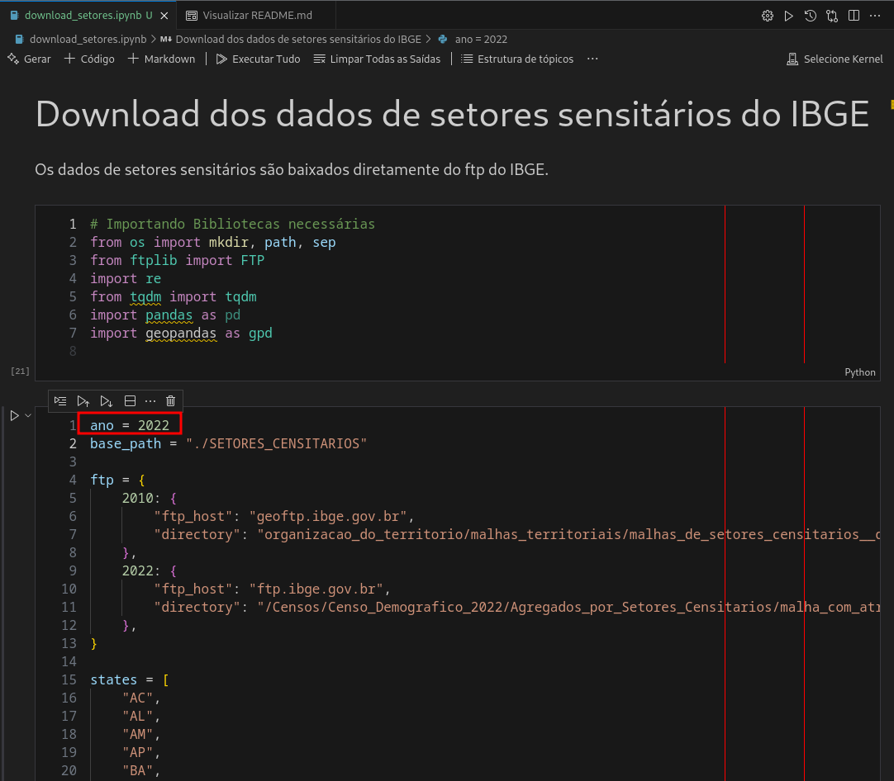
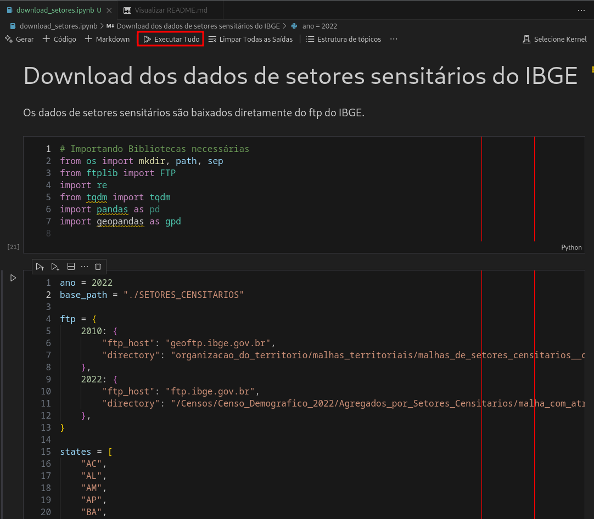
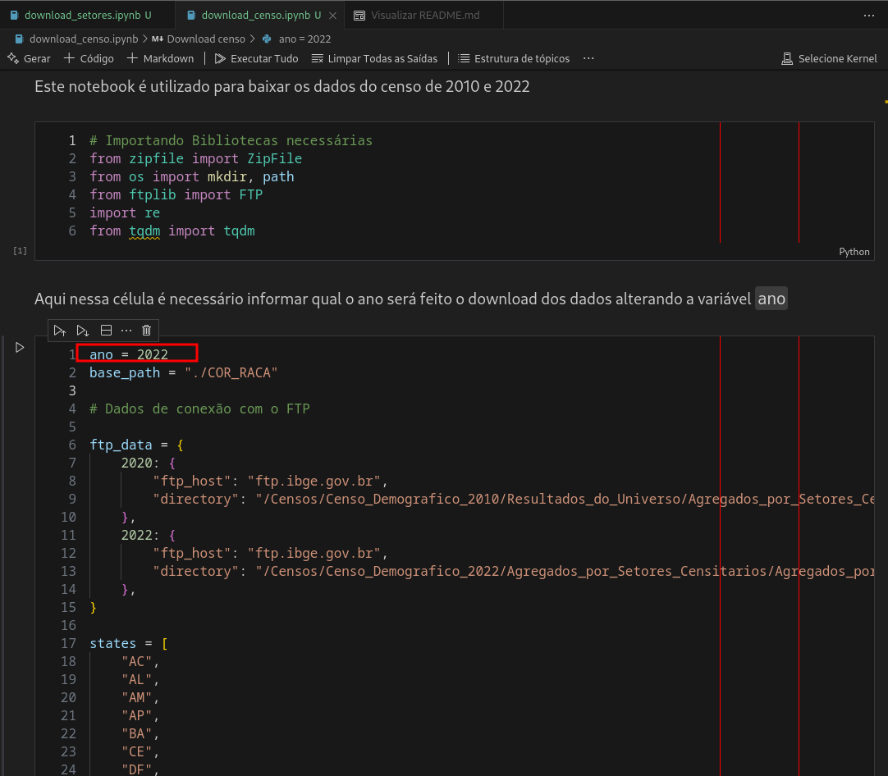
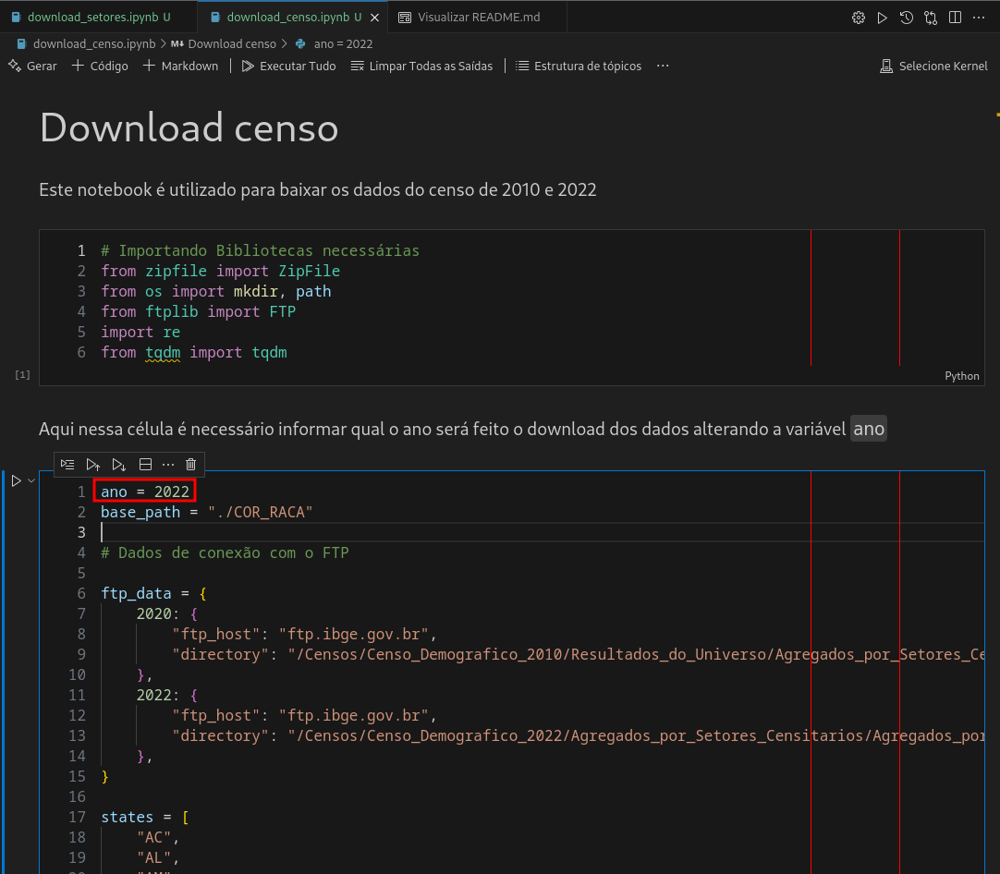
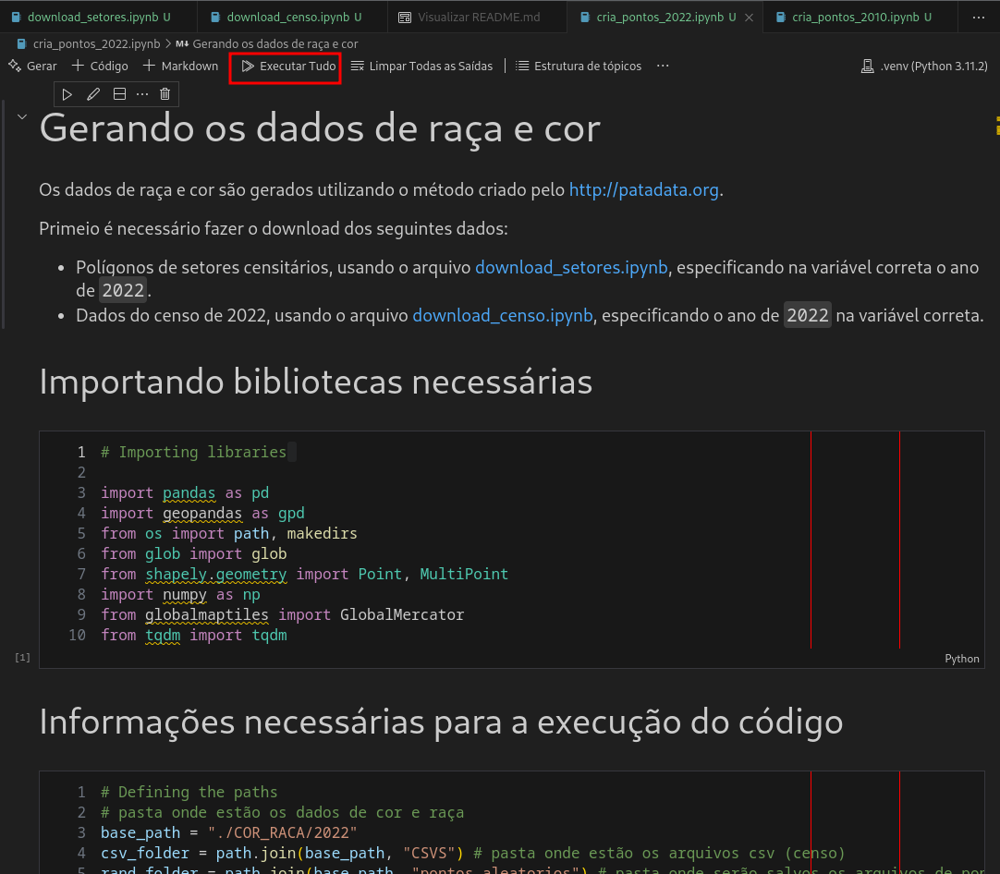

# Estudos temáticos - Cor e raça no Brasil

Este repositório é um fork do repositório do [Padadata](https://patadata.org/) [RacialDotMap-Brazil](https://github.com/zynphull/RacialDotMap-Brazil).

Aqui contém os códigos em Python para a criação de um banco de dados de pontos para cada pessoa no Brasil, codificado por raça, para serem disponibilizados na plataforma [Mapa das Periferias](https://mapadasperiferias.cidades.gov.br/), esses pontos são gerados de forma aleatória e não representam a localização real das pessoas.

Os dados utilizados para a codificação por raça são do [IBGE](https://www.ibge.gov.br/) e são referentes ao Censo Demográfico de 2022, os dados georreferenciados dos setores censitários, todos sendo baixados diretamente do ftp do IBGE por meio de código também.

Para a criação do banco de dados, foi utilizado o pacote [geopandas](https://geopandas.org/) para a manipulação de dados geográficos e o pacote [pandas](https://pandas.pydata.org/) para a manipulação de dados tabulares. Com esses pacotes é possível fazer a união dos dados do censo com os dados georreferenciados, e a criação de um banco de dados de pontos aleatórios.

Utilizamos também, para facilitar na documentação dos processos e na organização do código, o pacote [jupyter-book](https://jupyterbook.org/intro.html), que permite a criação de jupyter notebooks, onde é possível documentar o processo de criação do banco de dado.

O código inicial foi modificado para que pudesse ser executado em novas versões do [Python](www.python.org) e para que fosse possível fazer o download dos dados diretamente do ftp do IBGE, cruzamento dos mesmo e a criação dos pontos aleatórios, esses dois últimos processos são feitos em um único código, separados por ano do censo, devido as peculiaridades de cada ano.

## Como usar

### Instalando as dependências

Esse repositório utiliza [Poetry](https://python-poetry.org/) para gerenciar as dependências, para instalar as dependências, execute o seguinte comando:

Obs: É aconselhável criar um ambiente virtual para instalar as dependências.

```bash
poetry install
```

## Baixando os dados de Setores Sensitários

Para baixar os dados de setores censitários, vamos utilizar o notebook [download_setores.ipynb](download_setores.ipynb), que faz o download dos dados diretamente do ftp do IBGE.

1. Abra o notebook [download_setores.ipynb](download_setores.ipynb) e modifique o ano desejado na segunda célula de código com o ano desejado (2010 ou 2022).
    

2. Execute as células de código do notebook.
    

## Baixando os dados do Censo

Para baixar os dados do censo, vamos utilizar o notebook [download_censo.ipynb](download_censo.ipynb), que faz o download dos dados diretamente do ftp do IBGE.

1. Abra o notebook [download_censo.ipynb](download_censo.ipynb) e modifique o ano desejado na segunda célula de código com o ano desejado (2010 ou 2022).
    

2. Execute as células de código do notebook.
    

## Criando o banco de dados

Para criar o banco de dados, vamos utilizar o notebook de acordo com o ano [cria_pontos_2010.ipynb](cria_pontos_2010.ipynb) para o ano de 2010 e [cria_pontos_2022.ipynb](cria_pontos_2022.ipynb) para o ano de 2022, que faz o cruzamento dos dados do censo com os dados georreferenciados e a criação dos pontos aleatórios.

1. Abra o notebook de acordo com o ano desejado e execute as células de código.
    

Os arquivos serão salvos na pasta `./COR_RACA/{ANO}/pontos_aleatorios`, onde `{ANO}` é o ano do censo.
O nome do arquivo de ponto aleatório é sempre formado por `{sigla_uf}_pontos_pessoas.gpkg` onde `{sigla_uf}` é a sigla do estado.

## Ordenando os dados
Após a criação dos pontos aleatórios, é necessário ordenar os dados para facilitar a renderização no mapa, para isso, vamos utilizar o terminal para utilizar menos memória e aumentar a velocidade de execução.
Vamos ordenar os dados utilizando o comando `ogr2ogr`, que é um comando do [GDAL](https://gdal.org/) para manipulação de dados geoespaciais pelo campo `quadkey`, que é o campo utilizado para a renderização dos dados no mapa.

1. Abra o terminal e navegue até a pasta onde os dados foram salvos.
2. Execute o seguinte comando para ordenar os dados:

>> Obs: O comando deve ser executado para cada arquivo de ponto aleatório criado.

```bash
ogr2ogr -f GPKG <nome_do_arquivo_de_saida>.gpkg \
        -sql "SELECT * FROM <nome_da_camada> ORDER BY quadkey" \
        -unsetFid \
        -nln teste_ordem \
        <endereco_do_arquivo>.gpkg
```

Onde:

* `<nome_do_arquivo_de_saida>`: Nome do arquivo de saída onde será salvo os dados ordenados.
* `<nome_da_camada>`: Nome da camada do arquivo de entrada (costuma ser o mesmo nome do arquivo de entrada).
* `<endereco_do_arquivo>`: Endereço do arquivo de entrada a ser ordenado.

Exemplo de comando:

```bash
ogr2ogr -f GPKG ac_pontos_ordenados.gpkg \
        -sql "SELECT * FROM ac_pontos_pessoas ORDER BY quadkey" \
        -unsetFid \
        -nln teste_ordem \
        ./COR_RACA/2022/pontos_aleatorios/ac_pontos_pessoas.gpkg
```

## Publicando os dados no Mapa das Periferias

Após a criação dos pontos aleatórios e ordenação, é necessário publicar os dados no [Mapa das Periferias](https://mapadasperiferias.cidades.gov.br/), para isso, vamos precisar de alguns dados:

* `db_host`: Host do banco de dados
* `db_port`: Porta do banco de dados
* `db_user`: Usuário do banco de dados
* `db_password`: Senha do banco de dados
* `db_name`: Nome do banco de dados

Esses dados devem ser informados via variável de ambiente ou no arquivo `.env` na raiz do projeto. Podemos copiar o arquivo `.env.example` e preencher as variáveis.

Ex.:

```bash
cp .env.example .env
```

Vamos precisar também de algumas informações sobre a tabela onde os dados serão salvos:

* `table_name`: Nome da tabela onde os dados serão salvos
* `schema_name`: Nome do schema onde a tabela será criada

Essas informações devem ser alteradas no notebook [publica_dados.ipynb](publica_dados.ipynb).

### Publicando os dados

1. Abra o notebook [publica_dados.ipynb](publica_dados.ipynb) e modifique as variáveis de acordo com os dados do banco de dados.
    

2. Execute as células de código do notebook.
    

## Dicionario de dados

### Ano de 2010

| Coluna | Descrição | Tipo |
| --- | --- | --- |
| `CD_GEOCODI` | Código do Setor Censitário | `str` |
| `TIPO` | Tipo do Setor Censitário  | `str` |
| `CD_GEOCODB` | Ver na documentação do IBGE | `str` |
| `NM_BAIRRO` | Ver na documentação do IBGE | `str` |
| `CD_GEOCODS` | Ver na documentação do IBGE | `str` |
| `NM_SUBDIST` | Ver na documentação do IBGE | `str` |
| `CD_GEOCODD` | Ver na documentação do IBGE | `str` |
| `NM_DISTRIT` | Ver na documentação do IBGE | `str` |
| `CD_GEOCODM` | Ver na documentação do IBGE | `str` |
| `NM_MUNICIP` | Nome do Município do Setor Censitário| `str` |
| `NM_MICRO` | Nome da Microrregião | `str` |
| `NM_MESO` | Nome da Mesorregião | `str` |
| `cod_uf` | Código do Estado | `str` |
| `total_pessoas`| Quantidade de pessoas no setor censitário | `int` |
| `pessoas_brancas` | Quantidade de pessoas da raça/cor no setor censitário | `int` |
| `pessoas_pretas` | Quantidade de pessoas da raça/cor no setor censitário | `int` |
| `pessoas_amarelas` | Quantidade de pessoas da raça/cor no setor censitário | `int` |
| `pessoas_pardas` | Quantidade de pessoas da raça/cor no setor censitário | `int` |
| `pessoas_indigenas` | Quantidade de pessoas da raça/cor no setor censitário | `int` |
| `raca_cor` | Raça ou cor da pessoa representada pelo ponto | `str` |
| `tile_x`| Eixo x do tile | `int` |
| `tile_y` | Eixo y do tile | `int` |
| `quadkey` | Quadkey do tile | `str` |
| `geometry` | Geometria do ponto | `geometry` |

### Ano de 2022

| Coluna | Descrição | Tipo |
| --- | --- | --- |
| `COD_SETOR` | Código do setor censitário | `str` |
| `SITUACAO`| Situação do Setor Censitário (Urbana/Rural) | `str` |
| `CD_SIT`| Situação detalhada do Setor Censitário | `str` |
| `CD_TIPO`| Tipo do Setor Censitário | `str` |
| `AREA_KM2`| Área do Setor Censitário em quilômetros quadrados | `float` |
| `CD_REGIAO`| Código das Grandes Regiões (Regiões Geográficas) | `str` |
| `NM_REGIAO`| Nome das Grandes Regiões (Regiões Geográficas) | `str` |
| `CD_UF`| Código da Unidade da Federação | `str` |
| `NM_UF`| Nome da Unidade da Federação | `str` |
| `CD_MUN`| Código do Município | `str` |
| `NM_MUN`| Nome do Município | `str` |
| `CD_DIST`| Código do Distrito | `str` |
| `NM_DIST`| Nome do distrito | `str` |
| `CD_SUBDIST`| Código do Subdistrito | `str` |
| `NM_SUBDIST`| Nome do Subdistrito | `str` |
| `CD_BAIRRO`| Código do Bairro | `str` |
| `NM_BAIRRO`| Nome do Bairro | `str` |
| `CD_NU`| Código do Núcleo Urbano | `str` |
| `NM_NU`| Nome do Núcleo Urbano | `str` |
| `CD_FCU`| Código da Favela ou Comunidade Urbana | `str` |
| `NM_FCU`| Nome da Favela ou Comunidade Urbana | `str` |
| `CD_AGLOM`| Código do Aglomerado | `str` |
| `NM_AGLOM`| Nome do Aglomerado | `str` |
| `CD_RGINT`| Código da Região Geográfica Intermediária | `str` |
| `NM_RGINT`| Nome da Região Geográfica Intermediária | `str` |
| `CD_RGI`| Código da Região Geográfica Imediata | `str` |
| `NM_RGI`| Nome da Região Geográfica Imediata | `str` |
| `CD_CONCURB`| Código da Concentração Urbana | `str` |
| `NM_CONCURB`| Nome da Concentração Urbana | `str` |
| `total_pessoas`| Quantidade de pessoas no setor censitário | `int` |
| `pessoas_brancas` | Quantidade de pessoas da raça/cor no setor censitário | `int` |
| `pessoas_pretas` | Quantidade de pessoas da raça/cor no setor censitário | `int` |
| `pessoas_amarelas` | Quantidade de pessoas da raça/cor no setor censitário | `int` |
| `pessoas_pardas` | Quantidade de pessoas da raça/cor no setor censitário | `int` |
| `pessoas_indigenas` | Quantidade de pessoas da raça/cor no setor censitário | `int` |
| `raca_cor` | Raça ou cor da pessoa representada pelo ponto | `str` |
| `tile_x`| Eixo x do tile | `int` |
| `tile_y` | Eixo y do tile | `int` |
| `quadkey` | Quadkey do tile | `str` |
| `geometry` | Geometria do ponto | `geometry` |

## Documentações

* [Patadata](https://patadata.org/)
* [Repositório Brazil Racial Dotmap](https://github.com/zynphull/RacialDotMap-Brazil)
* [Documentação dos nomes dos campos utilizados no censo de 2022](https://agenciadenoticias.ibge.gov.br/media/com_mediaibge/arquivos/3083d0bc0f22b062362290dd2c67b914.pdf)
